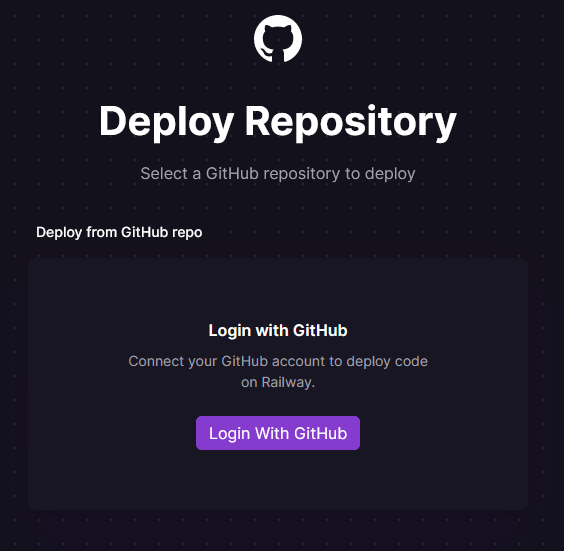

# Desplegando un Back-End en Railway

Railway nos aporta la infraestructura necesaria para que podamos desplegar nuestros proyectos, en este caso vamos a desplegar un back-end hecho con NodeJS.

  

Al clickar en el botón de "Start a New Project" podemos acceder a distintas opciones:

- Utilizar una plantilla predeterminada suya como por ejemplo el stack de Vite + React + Typescript, entre muchas otras.
 
- Desplegar algún tipo de bases de datos.
  
- Crear un proyecto vacio y personalizarlo desde 0.
 
- Utilizar tu cuenta de Github para enlazar los repositorios y crear el servicio desde ese punto.
  

  

Tendremos que loguearnos utilizando nuestra cuenta de Github.

  

Railway necesita tener acceso a ciertos permisos de tu cuenta de Github, en este caso necesita tener acceso de lectura a metadata y acceso de lectura y escritura a actions, administration, checks, code, commit statuses, deployments, pull request y workflows. Luego seleccionaremos si queremos darle acceso a todos nuestros repositorios o solo a los que le indiques, en mi caso como solo voy a desplegar uno preparado para esta guia, selecciono el indicado.

  

Antes de que se produzca el despliegue, tenemos la opción de añadir las variables de entorno.

  

Este es el panel desde donde tendremos acceso al proyecto que se ha creado, en este se pueden observar varias opciones:
- Arriba/Izquierda: Se puede configurar el proyecto para distintos entornos/ambientes en este caso tenemos uno llamado "production".
  
- Abajo/Izquierda: Existe la posibilidad de conectar nuestro proyecto por consola utilizando Railway CLI.
  
- Arriba/Derecha: Menú con las opciones de mostrar la documentación de Railway, un apartado de ayuda, el "dashboard" donde se muestran todos los proyectos que tienes, el plan que se tenga contratado, por defecto es "Starter plan" y la configuración de tu cuenta junto a la creación de equipos.
  
- Barra lateral: Se muestra un historial de las acciones que han ido ocurriendo en cada uno de los servicios desplegados, justo arriba de esta barra se muestra las opciones para crear un nuevo proyecto y las opciones de cada proyecto.

  

Al clickar en la pestaña "dashboard" se muestra esta pantalla con los proyectos que tienes creados en la actualidad.

  

Dentro de las herramientas de cada proyecto disponemos de este panel donde podemos acceder a la información general del proyecto, los entornos/ambientes, webhooks (procesos automatizados), los miembros del proyecto, tokens generados, integraciones con otras aplicaciones y un apartado danger para borrar el proyecto o los servicios dentro de él.

  

Ahora se muestran las diferentes opciones cuando hacemos click en cada uno de nuestros servicios dentro de nuestro proyecto. En la primera pestaña "Deployments" podemos ver un historial con todo lo ocurrido en nuestro servicio y el estado del servicio en la actualidad. En el botón "View Logs" podemos ver tanto los logs de construcción del servicio como los logs de la aplicación desplegada, además también hay una pestaña de detalles del servicio con un resumen del mismo.

  

En la segunda pestaña "Variables" se muestran las variables de entorno y podemos añadir nuevas.

  

En la tercera pestaña "Metrics" podemos ver las estadísticas de nuestro servicio, se muestran 3 parámetros, el uso de CPU, el uso de Memory y Network.

  

En la cuarta y última pestaña "Settings" accedemos a un apartado ajustes del proyecto:
- Tenemos "Environment" donde podemos establecer la rama del repositorio por la cual al actualizarla el servicio se volvera a desplegar (trigger) y también podemos generar un dominio aleatorio o uno personalizado.
  
- Por otro lado tenemos "Service" donde se muestra información del repositorio de Github del servicio, como se ha construido la "build" del servicio (puedes incluir comandos personalizados para generarla), opciones del "deploy" como un comando para correr cuando se despliegue o "Restart Policy" para proporcionar la configuración a la hota de reiniciar el servicio y por último existe un apartado "Danger" para borrar el servicio de todos los ambientes.

  

El plan que tienes por defecto para utilizar las herramientas que te ofrece Railway es "Starter Plan", este te ofrece 500 horas de ejecución de sus servicios y 5 dolares de uso cada mes. En el caso de querer tener más recursos (más memoria, más procesador, más espacio en el disco duro) y eliminar la restricción de tiempo deberiamos contratar el "Developer Plan" aunque los primeros 5 dolares en este plan siguen siendo gratis. Existe un plan superior en el cual puedes tener aun más recursos y compartir proyectos llamado "Team Plan".

  

😀 Hecho por [Germán Fernández](https://www.linkedin.com/in/geerdev/) :technologist: